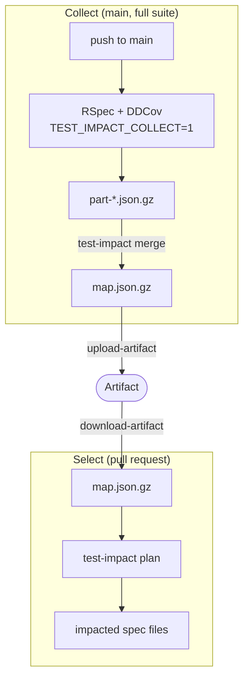

# test_impact

Test Impact Analysis for Ruby — without a Datadog backend.

`test_impact` runs only the RSpec files affected by your change, using a
per-test coverage map built from real coverage data (not heuristics). It is
inspired by [Datadog CI Visibility's Test Impact
Analysis](https://docs.datadoghq.com/tests/test_impact_analysis/), but stores
the coverage map in your own infrastructure — a GitHub Actions Artifact — so
it works without a Datadog subscription.

## How it works

Coverage is collected using [datadog-ci](https://github.com/DataDog/datadog-ci-rb)'s
native `DDCov` extension, used standalone (no `Datadog.configure`, no agent,
no Datadog account required). For each example, `test_impact` records which
source files were exercised and aggregates that into a **file-level**
coverage map: source file → set of spec files that cover it.

The system has two layers:



- **Collect**: on every full run on `main` (or a merge queue), RSpec runs with
  coverage collection turned on. Each CI node writes a partial map
  (`part-*.json.gz`); a merge job combines them into a single map and saves
  it as a GitHub Actions Artifact.
- **Select**: on a pull request, the CI downloads the latest map artifact,
  diffs the PR branch against its merge-base, and asks `test_impact` which
  spec files are impacted. Only those specs run.

Because collection only happens on the already-required full run on `main`,
PR builds pay **zero extra overhead** for coverage collection — they only pay
the cost of `test-impact plan`, which is a git diff plus a hash lookup.

## Requirements

- Ruby >= 3.3
- RSpec
- git

## Installation

Add to the `:test` group of your `Gemfile`:

```ruby
group :test do
  gem "test_impact"
end
```

Then:

```sh
bundle install
```

## Setup

Add one line to `spec/spec_helper.rb` (before `RSpec.configure` is fine, order
relative to other requires doesn't matter):

```ruby
require "test_impact/frameworks/rspec"
```

This line is a **complete no-op** unless `TEST_IMPACT_COLLECT=1` is set in the
environment. When it's not set, the file returns immediately and does not
register any RSpec hooks, so there is no overhead and no behavior change for
local development or PR test runs.

When `TEST_IMPACT_COLLECT=1` **is** set (typically only in the "collect on
main" CI job), it wires up:

- `prepend_before(:each)` / `append_after(:each)` hooks that start/stop DDCov
  around every example (including `let` evaluation and `before` blocks, since
  `prepend_before`/`append_after` wrap the whole example, not just the body)
- an `after(:suite)` hook that records `RSpec.configuration.files_to_run` and
  writes the partial coverage map
- an `at_exit` fallback that writes the map if `after(:suite)` didn't run (the
  write is idempotent/guarded so it never writes twice)

By default, if the `DDCov` coverage backend can't be set up, collection fails
loudly instead of silently producing a useless map — see "Coverage backend
unavailable" under [Accuracy & Safety](#accuracy--safety) below.

## Usage

All commands are available via the `test-impact` executable.

### `test-impact merge`

Merges `part-*.json.gz` files (written by the RSpec integration during
collection) into a single map. Merging is a pure set union and is idempotent
— merging the same part twice does not change the result.

| Option | Default | Description |
|---|---|---|
| `--input` | `tmp/test_impact` | Directory containing `part-*.json.gz` files |
| `--output` | `.test_impact/map.json.gz` | Output path for the merged map |

```sh
test-impact merge --input tmp/test_impact --output .test_impact/map.json.gz
```

### `test-impact info`

Prints summary information about a map file (schema version, commit, branch,
generated_at, backend, file/spec counts) to stdout. Useful for debugging.

| Option | Default | Description |
|---|---|---|
| `--map` | `.test_impact/map.json.gz` | Path to the map file |

```sh
test-impact info --map .test_impact/map.json.gz
```

### `test-impact plan`

Prints the spec files impacted by the current diff. **All diagnostics go to
stderr; stdout carries only the result**, so `$(test-impact plan)` can be
passed directly to `rspec` or to `split-test`/`parallel_tests`.

| Option | Default | Description |
|---|---|---|
| `--map` | `.test_impact/map.json.gz` | Path to the map file |
| `--base` | (see below) | Base ref to diff against |
| `--format` | `lines` | `lines` or `json` |
| `--fallback-to-all-exit-code` | `10` | Exit code used in `lines` format when the plan says "run everything" |
| `--include-uncommitted` | `false` | Also consider staged / unstaged / untracked working tree changes |

Base ref resolution order: `--base` > `GITHUB_BASE_REF` (prefixed with
`origin/`) > `.test_impact.yml`'s `base` (default `origin/main`).

```sh
# lines format (default) — feed straight into rspec
test-impact plan
rspec $(test-impact plan)
```

When running `plan` against code being edited locally (including AI-agent
edits) that isn't committed yet, pass `--include-uncommitted`. This makes the
diff span merge-base through the working tree, and untracked files reported
by `git ls-files --others --exclude-standard` are treated as newly added. It
does not modify repository state (read-only). CI should typically not use
this flag, since it should only consider committed diffs. Also note: if
`.test_impact/` isn't gitignored, the map file itself becomes untracked and
would trigger a full run — `.test_impact/` must be in `.gitignore` for this
flag to be useful.

```sh
test-impact plan --include-uncommitted
```

#### Exit code contract

| Exit code | Meaning | `lines` stdout |
|---|---|---|
| `0` | Partial run, or nothing impacted | spec files, one per line (empty if none) |
| `10` | Run everything (no map / stale map / unknown file changed) | *(empty)* |
| `1` | Unexpected error (invalid arguments, unreadable git state, ...) | *(empty)* |

**This is important**: in `lines` format, both "run zero specs" (exit 0,
because the diff genuinely impacts nothing) and "run every spec" (exit 10)
print an empty line to stdout. You must branch on the exit code — you cannot
tell the two apart from stdout alone. `set -e` is safe with this convention
because `10` is a normal, expected outcome (unlike `1`, which signals a real
error).

```sh
if test-impact plan > /tmp/specs.txt; then
  if [ -s /tmp/specs.txt ]; then
    bundle exec rspec $(cat /tmp/specs.txt)
  fi
  # empty file = exit 0 with nothing impacted: run nothing
elif [ $? -eq 10 ]; then
  bundle exec rspec
else
  exit 1
fi
```

For scripting, `--format json` plus `jq` is the recommended, unambiguous way
to consume the result — it always distinguishes `all` / `partial` / `none`
regardless of exit code:

```sh
test-impact plan --format json > /tmp/plan.json
mode=$(jq -r '.mode' /tmp/plan.json)

if [ "$mode" = "all" ]; then
  bundle exec rspec
else
  mapfile -t specs < <(jq -r '.spec_files[]' /tmp/plan.json)
  [ "${#specs[@]}" -gt 0 ] && bundle exec rspec "${specs[@]}"
fi
```

## Configuration

`.test_impact.yml` at the repository root. All keys are optional.

```yaml
base: origin/main
max_age_days: 7
always_run:
  - spec/smoke/**/*_spec.rb
global_files:
  - Gemfile
  - Gemfile.lock
  - "*.gemspec"
  - .ruby-version
  - Dockerfile
  - config/**/*
  - db/schema.rb
  - db/structure.sql
  - spec/spec_helper.rb
  - spec/rails_helper.rb
  - spec/factories/**/*
  - spec/fixtures/**/*
ignore:
  - .rubocop.yml
  - .github/**/*
  - "LICENSE*"
collector:
  allocation_tracing: true
  ignored_paths:
    - vendor/
    - tmp/
```

| Key | Default | Description |
|---|---|---|
| `base` | `"origin/main"` | Default base ref for `test-impact plan` |
| `max_age_days` | `7` | A map older than this (by `generated_at`) is treated as stale → run everything |
| `always_run` | `[]` | Glob patterns (see below); any known or impacted spec file matching these is always included |
| `global_files` | see above | Glob patterns (see below); a change to any matching file forces a full run |
| `ignore` | `[]` | Glob patterns (see below); matching changed files are treated as having no impact at all — see [Accuracy & Safety](#accuracy--safety) |
| `collector.allocation_tracing` | `true` | Passed to DDCov; catches coverage that pure line coverage misses (e.g. bare constant references), at some collection-time cost |
| `collector.ignored_paths` | `["vendor/", "tmp/"]` | Dual-mode (see below): a pattern containing glob metacharacters (`* ? [ ] { }`) is matched as a glob; otherwise it's a plain path prefix (relative to repo root). The defaults are prefixes, matched with `start_with?` |

`always_run`, `global_files`, and `ignore` all share the same glob semantics,
matched with `File.fnmatch?(pattern, path, File::FNM_PATHNAME | File::FNM_EXTGLOB | File::FNM_DOTMATCH)`:

- `FNM_PATHNAME` means `*` does not cross a `/` — `*.yml` matches
  `database.yml` but not `config/database.yml`; use `**/*.yml` to match at any
  depth.
- `FNM_EXTGLOB` enables `{a,b}`-style alternation.
- `FNM_DOTMATCH` makes `**/*.yml` match dotfiles too, e.g. `.rubocop.yml` —
  without it, a pattern like that would silently skip every dotfile. The same
  flag also lets `**` descend into dot-*directories*, so `**/*.yml` reaches
  `.github/workflows/deploy.yml` and `.circleci/config.yml` as well. The two
  cannot be separated. This matters most for `ignore`, where matching too much
  means skipping specs you wanted to run: to take only the dotfiles at the
  repo root, write `*.yml` (no `**` — `FNM_PATHNAME` stops it at `/`), or
  list the directories you mean explicitly.

`collector.ignored_paths` shares these same flags, but only for entries that
are actually globs — a plain prefix like the default `vendor/` is matched
with `start_with?` instead and never goes through `File.fnmatch?` at all.

`ignore` and `collector.ignored_paths` act in different phases and do not
imply one another. If you add a path with a tracked extension (`.rb`, `.erb`,
…) to `collector.ignored_paths`, it stops being indexed as a coverage source,
so changing it later reads as an *uncovered* file and falls back to a full
run. To keep such a path out of both phases, list it in `ignore` as well.

Setting `always_run` or `global_files` **replaces the default entirely**; it
does not add to it. If you set `global_files` and still want the built-in
defaults (Gemfile, `config/**/*`, factories, fixtures, etc.), copy the list
above into your own config and add to it. `ignore` has no default to
preserve, since it starts empty. `collector` is the only nested key that's
merged rather than replaced: an explicit `collector:` in your config is
shallow-merged over `DEFAULT_COLLECTOR`, and a key you omit (or leave blank,
e.g. a bare `ignored_paths:`) falls back to its default rather than
disappearing.

Note that `FNM_DOTMATCH` also means `global_files` patterns now match
hidden files they previously didn't — e.g. `config/**/*` matches
`config/.keep`. This only makes more changes trigger a full run, never fewer,
so it's a safe-direction behavior change.

## GitHub Actions

### Collect on `main` (matrix + merge)

```yaml
name: test-impact-collect
on:
  push:
    branches: [main]

jobs:
  collect:
    runs-on: ubuntu-latest
    strategy:
      matrix:
        ci_node: [0, 1, 2, 3]
    env:
      TEST_IMPACT_COLLECT: "1"
    steps:
      - uses: actions/checkout@v4
      - uses: ruby/setup-ruby@v1
        with:
          ruby-version: "3.4"
          bundler-cache: true
      - run: bundle exec rspec --format progress
        env:
          # split however your test-splitting tool of choice expects
          CI_NODE_INDEX: ${{ matrix.ci_node }}
          CI_NODE_TOTAL: 4
      - uses: actions/upload-artifact@v4
        with:
          name: test-impact-parts-${{ matrix.ci_node }}
          path: tmp/test_impact/part-*.json.gz
          retention-days: 1

  merge:
    needs: collect
    runs-on: ubuntu-latest
    steps:
      - uses: actions/checkout@v4
      - uses: ruby/setup-ruby@v1
        with:
          ruby-version: "3.4"
          bundler-cache: true
      - uses: actions/download-artifact@v4
        with:
          pattern: test-impact-parts-*
          path: tmp/test_impact
          merge-multiple: true
      - run: bundle exec test-impact merge
      # `name` here must match the `name` used by actions/download-artifact
      # in the select workflow below.
      - uses: actions/upload-artifact@v4
        with:
          name: test-impact-map
          path: .test_impact/map.json.gz
          retention-days: 30
```

### Select on pull requests

```yaml
name: test-impact-select
on:
  pull_request:

permissions:
  contents: read
  actions: read # required to read the collect workflow's artifact

jobs:
  select:
    runs-on: ubuntu-latest
    steps:
      - uses: actions/checkout@v4
        with:
          fetch-depth: 0 # merge-base needs full history
      - uses: ruby/setup-ruby@v1
        with:
          ruby-version: "3.4"
          bundler-cache: true

      # Find the most recent successful collect run on main
      - id: collect_run
        run: |
          run_id=$(gh run list --workflow=test-impact-collect.yml \
            --branch=main --status=success --limit=1 \
            --json databaseId --jq '.[0].databaseId')
          echo "id=$run_id" >> "$GITHUB_OUTPUT"
        env:
          GH_TOKEN: ${{ secrets.GITHUB_TOKEN }}

      # No map (expired, or no collect run yet) is fine: plan falls back to
      # running everything.
      - uses: actions/download-artifact@v4
        continue-on-error: true
        with:
          name: test-impact-map
          path: .test_impact
          run-id: ${{ steps.collect_run.outputs.id }}
          github-token: ${{ secrets.GITHUB_TOKEN }}

      - id: plan
        run: |
          set +e
          bundle exec test-impact plan > /tmp/specs.txt
          echo "exit_code=$?" >> "$GITHUB_OUTPUT"
      - if: steps.plan.outputs.exit_code == '0'
        run: |
          if [ -s /tmp/specs.txt ]; then
            bundle exec rspec $(cat /tmp/specs.txt)
          else
            echo "no impacted specs"
          fi
      - if: steps.plan.outputs.exit_code == '10'
        run: bundle exec rspec
      - if: steps.plan.outputs.exit_code != '0' && steps.plan.outputs.exit_code != '10'
        run: exit 1
```

`actions/download-artifact` extracts to `.test_impact/map.json.gz`, which
matches the default value of `test-impact plan`'s `--map` option, so no
extra configuration is needed.

The `continue-on-error: true` on the download step is intentional: it keeps
the job from failing when no map is available, so `plan` safely falls back
to "run everything" (exit code `10`). If you'd rather treat a missing map as
a hard failure, drop that line.

## Accuracy & Safety

The design principle throughout is: **when in doubt, run everything.** A
false "skip" (silently not running a spec that should have run) is far worse
than an unnecessary full run. `test_impact` is deliberately biased toward
falling back to a full run (exit code `10` / mode `all`) whenever it cannot
be confident:

- **No map, or map fails to parse / has an unsupported `schema_version`** →
  run everything.
- **Stale map** — older than `max_age_days` (default 7 days), or its
  `commit_sha` is not reachable from current history → run everything.
- **Unknown/uncovered file changed** — a `.rb` file that changed but isn't a
  key in the map's `index` → run everything (it's either genuinely new, or
  the map is out of date), unless the path matches `ignore` (see below).
- **`global_files`** — changes to files like `Gemfile.lock`, anything under
  `config/**`, `spec/spec_helper.rb`, factories, fixtures, etc. always force
  a full run, since these can affect behavior in ways per-file coverage
  can't express.
- **View templates** — `.erb`/`.haml`/`.slim`/`.jbuilder` files are tracked
  like any other source file: DDCov records the file identifier a template
  was compiled under, and Rails compiles templates with their absolute path,
  so a template actually rendered during a spec shows up as an ordinary map
  key and only its dependent specs run. A template that isn't in the map
  falls back to a full run (safe). The legitimate reasons a template never
  appears in the map: controller specs without `render_views` never execute
  it; it was compiled under a non-absolute/virtual identifier (in-memory
  templates, some custom resolvers), which falls outside the repo root and is
  filtered out by DDCov; or it is rendered via a direct in-process eval (e.g.
  plain `ERB#result` called inside an ordinary method), which DDCov
  attributes to the caller instead — Rails' compiled-template mechanism is
  unaffected by this.
- **`always_run`** — glob patterns for specs that should run unconditionally
  regardless of what the diff/map say (e.g. smoke tests).
- **`ignore` is the one deliberate exception to "when in doubt, run
  everything."** A change matching `ignore` is treated as having no impact at
  all — not "run everything," not "run the specs coverage says depend on it,"
  nothing. This is checked before any other classification, including
  `global_files` and the spec-file check, so:
  - Writing a `.rb` or `.erb` pattern into `ignore` can suppress specs that
    coverage says genuinely depend on it. This is intentional: `ignore` is an
    explicit assertion from the user that a path has no test-relevant impact,
    and it is meant to override coverage when you know better.
  - If a changed `_spec.rb` file itself matches `ignore`, that spec is not
    scheduled either — "a changed spec always runs itself" is a default, not
    a guarantee `ignore` respects.
  - `always_run` is still checked afterwards and wins over `ignore`: a spec
    matching both `ignore` and `always_run` still runs, because `always_run`
    is applied after classification, scanning known/impacted spec files
    regardless of how they were classified. This keeps the one bias-breaking
    setting from stacking with itself in the unsafe direction.
  - This is unrelated to the built-in `.md`/`.txt`/`.adoc` fallback in
    `classify_other` (no user config needed): that check runs last, after
    `global_files`, so e.g. `spec/fixtures/README.md` still forces a full
    run via `global_files` despite its extension. `ignore`, by contrast, is
    checked *before* `global_files` and wins.
- **Coverage backend unavailable** — if `DDCov` fails to load or its
  behavior can't be verified at startup, collection **raises by default**,
  failing the collection job. The error message includes the class and
  message of the underlying exception, so the root cause (e.g. a
  Ruby-version/platform mismatch, or a `datadog-ci` upgrade that changed its
  internals) is visible directly in the job log. Set
  `TEST_IMPACT_REQUIRE_COVERAGE=0` to opt out of this: it makes collection
  fall back to a `NullBackend` instead, logging a one-line warning to stderr.
  (`false`, `no`, and `off` are accepted too — a misspelled opt-out would
  otherwise fail the job on the day the backend actually breaks.)
  A map produced this way is tagged `backend: "null"`, and the planner treats
  any map with a null backend as invalid and runs everything.

Even with all of this, per-test **coverage-based** impact analysis has an
inherent blind spot: coverage tells you which lines *ran*, not everything a
test's correctness *depends on*. As documented in
[Raksul's write-up on adopting a similar system](https://user-first.ikyu.co.jp/entry/2024/tia),
even line coverage combined with allocation tracing can miss dependencies
that never execute a traceable line — for example, behavior gated by
environment variables, external service contracts, or timing/ordering that
only manifests under specific data. Treat `test_impact` as a strong,
practical heuristic for day-to-day PR feedback, not a formal guarantee — keep
a scheduled/periodic full run of the suite (e.g., nightly, or on `main`) as a
backstop.

## Limitations

- Depends on `datadog-ci`'s internal, undocumented native extension API
  (`Datadog::CI::TestImpactAnalysis::Coverage::DDCov`, loaded via a
  Ruby-version/platform-specific require path). This is not a public,
  stable API — a `datadog-ci` upgrade could change or remove it. The
  `DdcovBackend` startup probe exists specifically to detect this and report
  it as a clear, actionable failure (naming the underlying exception) rather
  than silently collecting nothing.
- Licensing: `datadog-ci` is published under BSD-3-Clause, which permits
  using the gem (including DDCov) without Datadog's services. Should a
  future version change its license, the dependency constraint can be pinned
  to the last BSD release, and the `Collector::CoverageBackend` seam is
  designed so DDCov can be swapped for another per-test coverage collector
  without touching the planner or map layers.
- GitHub Actions Artifacts expire (`retention-days`, 30 in the example
  above, capped by the repo's overall retention setting). If the artifact
  expires before the next `main` collection run, the map won't be available
  and `test_impact` will fall back to running everything — correct, but
  slower.

## Agent skill

The gem bundles an agent skill at `skills/impacted-specs`, which gives coding
agents (e.g. Claude Code) a step-by-step procedure for detecting which specs
to run against local, uncommitted changes — fetching the latest
`test-impact-map` artifact and running `test-impact plan`. Symlink it from
your project (e.g. `.claude/skills/`) to use it, following the same
distribution convention as sgcop.

## License

[MIT](LICENSE.txt)
